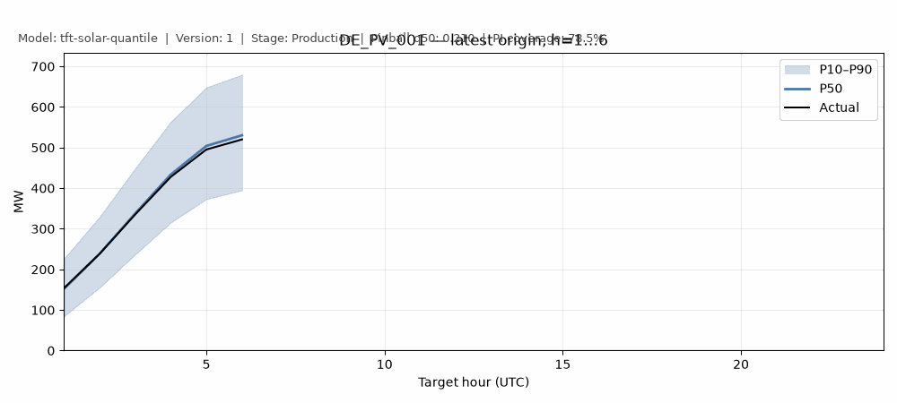
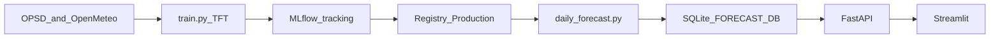

# energy-forecasting-service

[](https://github.com/mehmetertac/energy-forecasting-service-/actions/workflows/ci.yml)

Probabilistic day-ahead solar forecasts (**P10 / P50 / P90**) shipped end to end: training → MLflow → registry → batch job → FastAPI → Streamlit.



Ported from [`multi-site-solar-hierarchy`](https://github.com/mehmetertac/multi-site-solar-hierarchy) (TFT + feature pipeline). MinT reconciliation stays in that repo; this service ships the global plant-level TFT.

## Quick start (3 commands)

Requires **Docker Desktop** (or Docker Engine + Compose).

```powershell
git clone https://github.com/mehmetertac/energy-forecasting-service-.git
cd energy-forecasting-service-
docker compose up --build
```

| Service | URL |
|---------|-----|
| **Dashboard** | http://localhost:8501 |
| **API** | http://localhost:8000 |
| **MLflow** | http://localhost:5000 |

Compose starts MLflow, runs a one-shot **batch** job (`--seed-if-missing`), then brings up the API and dashboard. Open the dashboard to inspect P50 with the P10–P90 band, or hit the API directly:

```powershell
curl http://127.0.0.1:8000/health
curl -X POST http://127.0.0.1:8000/forecast `
  -H "Content-Type: application/json" `
  -d '{"plant_id":"DE_PV_001","horizon":24}'
```

## Architecture



**Data** — OPSD plant generation + Open-Meteo weather, disaggregated to hourly plant rows.

**Training** — Week 5 Temporal Fusion Transformer with `QuantileLoss` at 0.1 / 0.5 / 0.9 (168h encoder, 24h horizon). Rolling-origin CV logs pinball, CRPS, and PI coverage per fold.

**Registry** — Best run promoted to `models:/tft-solar-quantile/Production`.

**Batch job** — `scripts/daily_forecast.py` loads Production pyfunc, slices latest day-ahead origins, validates covariates, and atomically publishes to SQLite.

**API** — `POST /forecast` reads the store by `plant_id` + `horizon`. Sub-second lookups; no torch at request time.

**Dashboard** — Streamlit reads the same API contract: site selector, horizon slider, P50 line with P10–P90 band over actuals, pinball/coverage panel.

## API example

**Request** (`POST /forecast`):

```json
{
  "plant_id": "DE_PV_001",
  "horizon": 24,
  "as_of": null,
  "known_future": null
}
```

**Response** (excerpt):

```json
{
  "quantiles": [0.1, 0.5, 0.9],
  "inference_mode": "batch",
  "model_name": "tft-solar-quantile",
  "model_version": "1",
  "model_stage": "Production",
  "forecasts": [
    {
      "timestamp": "2020-01-30T10:00:00Z",
      "plant_id": "DE_PV_001",
      "horizon": 1,
      "pred_q10": 37.1,
      "pred_q50": 212.0,
      "pred_q90": 462.9,
      "actual": 205.0
    }
  ]
}
```

Quantiles are clipped to enforce P10 ≤ P50 ≤ P90. Structured JSON logs include `request_id` and `model_version`; error payloads use `{code, message, request_id, model_version}`.

## Who consumes these quantiles?

| Role | Surface | Decision |
|------|---------|----------|
| **Dispatch / forecast analyst** | Streamlit dashboard (:8501) | Visual check before the day-ahead gate: band width, recent pinball/coverage, which model version is live |
| **Nomination / EMS / reserve systems** | `POST /forecast` API (:8000) | Machine-readable P10/P50/P90 + `model_version` for schedules, reserve need, and audit trails |
| **Modeling / MLOps** | MLflow UI (:5000), `scripts/train.py`, `scripts/register_model.py` | Train, compare runs, promote Production — the desk reads the result; it does not run promotion |

| Quantile | Operational reading |
|----------|---------------------|
| **P50** | Central schedule: the MW you would bid or nominate as expected plant output |
| **P10** | Downside / firm capacity: output you can count on ~90% of hours — reserve **need** if solar under-delivers |
| **P90** | Upside / curtailment risk: output on high-resource hours — ramp and export constraints |

The P10–P90 band is an 80% prediction interval. If empirical coverage on rolling-origin folds drifts below ~80%, a dispatcher using the band as a reserve envelope is **under-hedged**; far above 80% means over-procuring reserve. CRPS and pinball (not MAE) decide whether a training run is better for this use.

Serving exposes the same three quantiles throughout — never a single MW point without the band.

## Design decisions

### Batch vs on-demand vs streaming

Day-ahead TFT needs a **168h encoder**, known-future calendar/solar rows for all **24 decoder steps**, and a rebuilt `TimeSeriesDataSet`. That work belongs on a **schedule**, not inside a request handler.

| Mode | When it fits | This repo |
|------|----------------|-----------|
| **Batch** | Day-ahead dispatch: forecasts fixed until the next scheduled run | **Default** — nightly `scripts/daily_forecast.py` → SQLite; API serves from `FORECAST_DB` |
| **On-demand** | Intra-day reforecasts when new NWP or meter data arrives | Not implemented; `known_future` on the request schema is reserved |
| **Streaming** | Sub-hourly updates pushed to subscribers | Out of scope |

### Model registry

Production resolves `models:/tft-solar-quantile/Production`. The batch job loads the pyfunc; the API reads SQLite — **not** a checkpoint path and **not** MLflow at request time. Promotion updates forecasts on the next batch run without rebuilding the Docker image.

### Docker image trade-offs

Multi-stage **serve-only** image (~**1.39 GB** — no torch). Model artifacts are **pulled at runtime** from MLflow, not baked in.

| Approach | Pros | Cons |
|----------|------|------|
| **Bake into image** | Works offline | Every promotion requires rebuild; `mlruns/` bloats layers |
| **Pull at runtime (chosen)** | Image stays code-only; registry updates without rebuild | Needs MLflow URI; empty store → 503 |

If on-demand TFT inference is added later, use the CPU torch index (~200 MB) — default CUDA torch (~2 GB) dominates image size. Details in [docker/README.md](docker/README.md).

### When to retrain

Retrain when empirical **P10–P90 coverage** drifts off the nominal **80%** band:

1. Check `GET /metrics` → `pi_coverage` (and fold metrics in MLflow).
2. Run `python scripts/train.py` (rolling-origin CV logs pinball, CRPS, coverage).
3. Promote with `python scripts/register_model.py`.
4. Publish: `python scripts/daily_forecast.py`.

## Train locally

Requires **Python 3.11**.

```powershell
python -m venv .venv
.venv\Scripts\Activate.ps1
pip install -e ".[dev,train,serve]"
python scripts/fetch_data.py
pytest tests/ -q

# Smoke train (logs to ./mlruns)
python scripts/train.py --n-splits 2 --max-epochs 2 --max-plants 2 --hidden-size 16 --limit-train-batches 20 --limit-val-batches 5 --run-name tft-h16-smoke

python scripts/register_model.py
python scripts/daily_forecast.py
uvicorn energy_forecasting.api.app:app --host 127.0.0.1 --port 8000
mlflow ui --backend-store-uri ./mlruns
```

Install git hooks once: `pre-commit install`

## Experiment tracking

**MLflow is the backbone** (self-managed, `./mlruns`). Each training run logs params, per-fold pinball/CRPS/coverage, OOF parquet, quantile-band plot, and checkpoint.

**W&B is optional** — mirror one run with `--wandb` on `scripts/train.py` (requires `WANDB_API_KEY`).

## Layout

```
src/energy_forecasting/data/    # OPSD + Open-Meteo, features
src/energy_forecasting/model/   # TFT, metrics, CV, MLflow tracking
src/energy_forecasting/api/     # P10/P50/P90 schema + FastAPI batch inference
src/energy_forecasting/serving/ # SQLite forecast store + day-ahead publish pipeline
scripts/train.py                # rolling-origin CV + tracking
scripts/register_model.py       # register best run → Production
scripts/daily_forecast.py       # nightly batch: registry → SQLite
dashboard/                      # Streamlit dashboard (:8501 in compose)
docker-compose.yml              # MLflow + batch + API + dashboard
.github/workflows/ci.yml
```

## Docs

| Doc | Purpose |
|-----|---------|
| [handover.md](handover.md) | Live status and API |
| [docs/linkedin.md](docs/linkedin.md) | Paste-ready public write-up |
| [docker/README.md](docker/README.md) | Image size, bake-vs-pull, compose notes |
| [dashboard/README.md](dashboard/README.md) | Dashboard setup |
| [data/README.md](data/README.md) | Sources and schemas |

## License

Apache-2.0. See [LICENSE](LICENSE).
